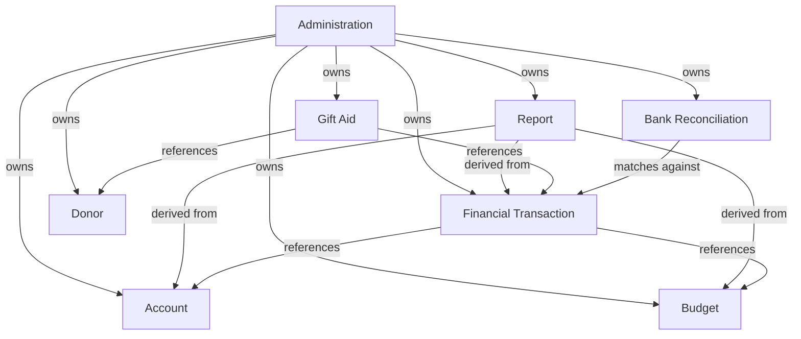

# Church Finance — Domain Model

## Scope

Church financial management for small independent churches, covering income, expenditure, fund management, budgeting, reporting and Gift Aid submission generation. Multi-tenant. Parent charity relationships and inter-charity reporting are out of scope.

---
## Key Functionality

* Budget creation and tracking functionality with reporting
* Importing bank statements and reconciliation
* Automated Gift Aid submission generation from recorded donations and donor declarations

---

## Event Storming

The following domain events were identified through event storming. Events are expressed in past tense to represent facts that have occurred in the domain.

### Income
- Donation Received *(Gift Aid eligible, known donor)*
- Plate Offering Received *(GASDS eligible, anonymous)*
- Restricted Income Received
- Designated Income Received
- Other Income Received
- HMRC Claim Received

### Expenditure
- Expense Submitted *(reimbursement to an individual)*
- Expense Paid
- Payment Made *(direct church payment e.g. hall hire, utilities)*
- Unbudgeted Spend Approved *(by church council or Voters Assembly depending on threshold)*
- Evidence Recorded *(receipts)*

### Banking
- Bank Transactions Imported
- Transaction Matched to Budget
- Bank Reconciliation Completed

### Accounts
- Fund Transfer Recorded
- Restricted Fund Override Approved

### Budget
- Budget Created
- Budget Ratified
- Unbudgeted Spend Approved

### Donors
- Donor Registered
- Gift Aid Declaration Received
- Gift Aid Declaration Withdrawn
- Gift Aid Declaration Expired

### Gift Aid
- Gift Aid Submission Generated
- Gift Aid Submission Sent to HMRC
- GASDS Submission Generated
- HMRC Claim Received

### Reporting
- Balance Sheet Generated
- Income and Expenditure Report Generated

### Administration
- Church Registered
- Import Format Configured
- System Admin Created
- Church Admin Created

---

## Aggregates

Eight aggregates were identified. Each aggregate represents a consistency boundary of domain objects. These boundaries also serve as module boundaries within the codebase and could, in principle, be extracted into independent services.

### Administration
Owns the church entity and everything required to operate a church within the system.

Responsibilities: church registration, user management, roles, bank import format configuration.

### Financial Transaction
Owns all recorded income and expenditure within the system, regardless of type. Income and expenditure are both Financial Transactions, differentiated by type and category.

Responsibilities: recording income (donations, plate offerings, restricted, designated, other), recording expenditure (expenses, payments), categorisation, evidence.

> **Note:** A distinction exists between an *Expense* (reimbursement to an individual for money already spent) and a *Payment* (the church directly paying for something). Both are Financial Transactions but have different processes.

### Bank Reconciliation
Owns the import and reconciliation of bank transactions. Persists reconciliation state so that reconciliation can resume from a known point rather than reprocessing from scratch.

Responsibilities: importing bank transactions, matching imported transactions to Financial Transactions, tracking reconciled-to date and amount, reconciliation completion.

Supported import formats: QFX to start with expansion later to others (e.g. OFX, CSV, QBO)

### Account
Owns the church's financial accounts, including restricted and designated funds (effectively virtual sub-accounts). Transfers between accounts and overrides of restricted funds are managed here.

Responsibilities: account management, fund transfers, restricted fund override approval.

> **Domain distinction:** A *Restricted* account cannot be used for another purpose without the original donor's approval. A *Designated* account is earmarked for a specific purpose but can be overridden by the appropriate authority.

### Budget
Owns the annual budget and its governance lifecycle. Unbudgeted spend approval is governed by threshold - church council or Voters Assembly depending on the amount.

Responsibilities: budget creation, budget ratification, budget lines, unbudgeted spend approval.

### Donor
Owns donor details and Gift Aid declarations. Donors are referenced by Gift Aid but not owned by it.

Responsibilities: donor registration, Gift Aid declaration management (received, withdrawn, expired).

> **Scope note:** Donor management is in scope specifically to enable automated Gift Aid submission generation. Full donor CRM functionality is out of scope.

### Gift Aid
Owns the Gift Aid submission process for both standard Gift Aid (known donors) and GASDS (anonymous/plate offerings). References Donor but does not own it.

Responsibilities: Gift Aid submission generation and submission to HMRC, GASDS submission generation, tracking HMRC claim receipt.

### Report
Owns the reporting lifecycle including report history and metadata. Reporting is a key feature area with significant potential for future development.

Responsibilities: balance sheet generation, income and expenditure report generation, report history and metadata (date, type, period covered).

---

## Aggregate Relationships

---

## Multi-Tenancy

The system is designed to support multiple independent churches, each with fully isolated data. Church identity (tenant) is a first-class concern in the data model, every entity belongs to a church. This is enforced at the Administration aggregate level.

Target initial deployment: small independent churches, initially within a single church group (~11 churches, ~250 people total).

---

## Out of Scope

- Parent charity relationships and inter-charity reporting
- Donor CRM beyond Gift Aid declaration management
- Property or seminary management
- Inter-charity fund transfers
- PDF bank statement import *(structured formats preferred)*